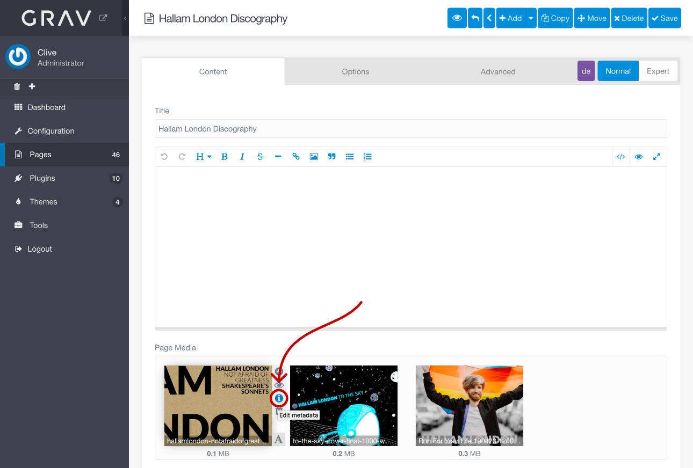
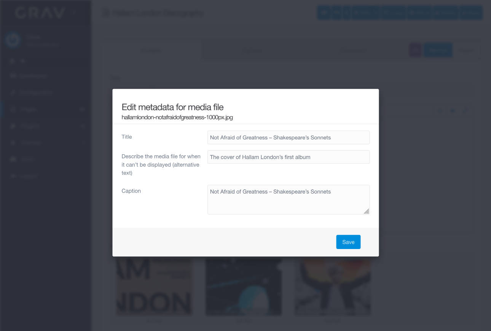

# Admin Addon Media Metadata Plugin

The **Admin Addon Media Metadata** Plugin is an extension for the [Grav CMS](http://github.com/getgrav/grav) [Admin plugin](https://github.com/getgrav/grav-plugin-admin). It lets you add and **edit metadata for media files** in the Page Media browser.

The Admin plugin has not been offering a feature like this yet. In order to add/edit metadata e.g. for an image you had to create a [image.filename].meta.yaml for the image in your file browser and edit it in a text editor.

## Usage and Features

- the plugin will create and edit [mediafile].meta.yaml files in your page folder via a simple form in the Admin plugin
- by default you can add/edit a **title,** **alt** text, and a **caption** – see *Configuration* section below on how to adapt this for your Grav installation
- multiline text can be added (e.g. for caption)
- in case you are storing additional, manually added data in your [mediafile].meta.yaml file, it will not be overwritten even if the form does not let you change it

### How to use it

*(see also screenshots below)*

1. hover any file in your Page Media section
2. hit the small «i» button to open the metadata form *(the regular «i» button which just showed the metadata will be overwritten by the plugin)*

## Installation

### Grav Package Manager (GPM)

If you can access your Grav installation via the command line, install the plugin by typing the following from your Grav root:

```
bin/gpm install admin-addon-media-metadata
```

### Admin Tool Web Interface

In the **Plugins** section, hit the **[+ Add]** button, search for Admin Addon Media Metadata and install.

### Manual Installation

To install the plugin manually, download the ZIP version of the latest release of this repository and unzip it under `/your/site/grav/user/plugins`. Then rename the folder to `admin-addon-media-metadata`. You can find these files on [GitHub](https://github.com/clivebeckett/grav-plugin-admin-addon-media-metadata/releases).

## Configuration

The default fields in the metadata form are alt, title, and caption. If you want to add more data to your meta.yaml files, please copy  
`user/plugins/admin-addon-media-metadata/admin-addon-media-metadata.yaml` to  
`user/config/plugins/admin-addon-media-metadata.yaml`  
and add more form fields to the form by updating the copy. E.g. if you want to add a field for a web link, you might add the following lines:

```
  - type: text
    label: Web link
    name: weblink
    placeholder: https://domain.tld/
```

The URL field will be available in your metadata form and you’ll be able edit the information.

### Additional Page Specific Metadata Fields

You may also add page specific fields to a page’s frontmatter. *Note: The fields will be added to the form, not override the ones from the above mentioned config files:*

```
admin-addon-media-metadata:
  metadata_form:
    fields:
      -
        type: text
        label: 'Yet another field'
        name: yetAnotherField
        placeholder: 'yet yet yet'
```

## Credits

I have based the plugin on Dávid Szabó’s [Admin Addon Media Rename plugin](https://github.com/david-szabo97/grav-plugin-admin-addon-media-rename). Much of the code would not have been possible for me without Dávid’s work.

[@renards](https://github.com/renards) helped a lot in replacing my original self-written Yaml parsing and writing code with Grav core technology and thus made version 1.0.0 possible.

## Screenshots




